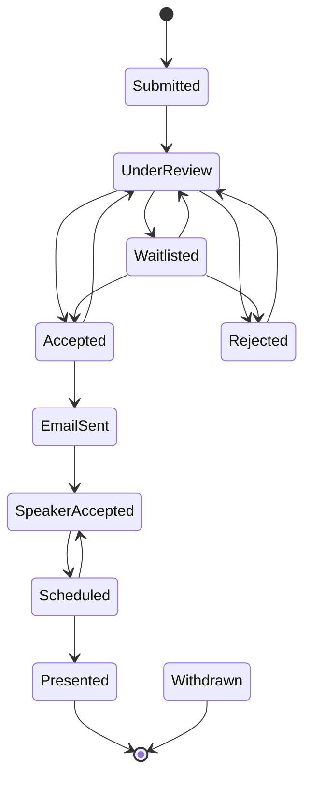
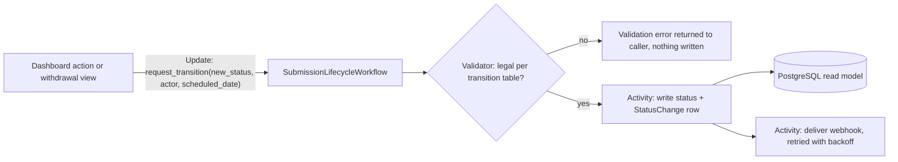

# meetup-cfp: Call for Proposals Platform Specification

## Overview

A multi-meetup Call for Proposals (CFP) platform that allows speakers to submit talk proposals to one or more meetups within a single organization.
The system provides role-based dashboards for meetup organizers to review, manage, and track submissions through their full lifecycle.

The public surface is intentionally minimal: submission forms only, no event listings or talk history.
All communication with speakers happens outside the platform; the app tracks status and notes.

The application is built as a Temporal application: every submission target is owned by a durable workflow that enforces the status state machine, and each meetup can register a webhook endpoint that receives lifecycle notifications.
See the Temporal Architecture section.

## Available Tooling

This is a Django/Python project.
All Python work in this repo uses the `python:python` skill: uv for package and environment management, ruff for linting and formatting, mypy for type checking, pytest for tests, strict type hints, and TDD for application code.

## Tech Stack

| Layer | Technology |
|-------|-----------|
| Backend | Django 6.0 (Python 3.12+) |
| Orchestration | Temporal (self-hosted server, `temporalio` Python SDK) |
| Frontend | Tailwind CSS 4.x via `django-tailwind-cli` 4.x (bundled standalone CLI, no Node.js), HTMX 2.x, Alpine.js 3.x |
| Database | SQLite (development), PostgreSQL 16 (production) |
| Auth | `django-allauth` 65.x (Django auth + GitHub & Google OAuth) |
| Spam Prevention | CAPTCHA (hCaptcha or Cloudflare Turnstile) |
| Deployment | Docker Compose on self-hosted VPS |
| Package Management | `uv` |
| File Storage | Local volume mount (Docker volume) |

Stack notes:

- `django-allauth` 65.x requires `allauth.account.middleware.AccountMiddleware` in `MIDDLEWARE` and configures providers via `SOCIALACCOUNT_PROVIDERS`.
- `django-tailwind-cli` 4.2+ supports Tailwind CSS 4.x only; Tailwind 4 uses CSS-based configuration, so no `tailwind.config.js` is needed.
- All `hx-*` attributes used in this spec are valid HTMX 2.x syntax.
- `django-allauth` 65.x supports Django 6.0.
- Temporal: development uses `temporal server start-dev`; production runs a self-hosted Temporal server in Docker Compose, sharing the PostgreSQL instance.
- Workflow code must be deterministic; all database and network side effects live in activities.
  Workflow definitions and activity definitions live in separate modules because the Python SDK sandbox reloads workflow files on every execution.
- Timezone handling: `USE_TZ = True`, all datetimes stored in UTC, and one org-wide display timezone via the `TIME_ZONE` setting.
  CFP window checks compare against timezone-aware `now()`.
  Document this behavior (UTC storage, single display timezone) in the project README.

## Django Project Structure

**Project name**: `meetup_cfp`

### Apps

| App | Responsibility |
|-----|---------------|
| `core` | Organization settings, global form field configuration, base models/mixins, Temporal worker entrypoint (`run_worker` management command) |
| `meetups` | Meetup models, branding, events, CFP window configuration, archival, webhook configuration and delivery activities |
| `submissions` | Proposals, custom questions, form rendering, file uploads, withdrawal, submission intake workflow |
| `reviews` | Voting, notes, communication tracking, status management, submission lifecycle workflow |
| `users` | Auth integration, role/permission models, per-meetup role assignment |
| `dashboard` | Admin views, reporting, filtering, export (CSV/JSON), warnings |

App boundary rule: `reviews` and `dashboard` may import from `submissions` and `meetups`; `submissions` may import from `meetups` and `core`; nothing imports from `dashboard`.
Cross-app writes go through model methods or service functions owned by the app that owns the model.
Each app that owns Temporal code keeps workflow definitions in `workflows.py` and activities in `activities.py`.

## Data Model

### Organization (singleton)

The organization is a single-instance configuration managed by super-admins.

- `name`: string
- `slug`: string (URL-friendly)
- `description`: text
- `logo`: image file
- `primary_color`: hex color (default branding)
- `secondary_color`: hex color

**Singleton enforcement**: the row is created by a data migration with placeholder values (`pk=1`).
`Organization.save()` forces `pk=1`; there is never zero or more than one row, so public pages can assume it exists.

### Meetup

Each meetup belongs to the organization and has its own identity and configuration.

- `name`: string
- `slug`: string (unique, used in URLs like `/meetups/{slug}/`)
- `description`: text
- `logo`: image file (optional, falls back to org logo)
- `primary_color`: hex color (optional, inherits from org)
- `secondary_color`: hex color (optional, inherits from org)
- `is_active`: boolean (deactivated meetups stop accepting submissions, hidden from public)
- `cfp_mode`: enum (`year_round`, `time_boxed`)
- `cfp_open_date`: datetime (nullable, for time-boxed mode)
- `cfp_close_date`: datetime (nullable, for time-boxed mode)
- `grace_period_minutes`: integer (default 0; minutes past `cfp_close_date` during which submissions are still accepted)
- `webhook_url`: URL (optional; endpoint for lifecycle notifications, see Webhook Notifications)
- `webhook_secret`: string (optional; HMAC-SHA256 signing key for webhook payloads)
- `created_at`: datetime
- `updated_at`: datetime

**Business rules:**

- Deactivated meetups retain all data but are hidden from public pages and stop accepting submissions.
- Only meetups with an open CFP appear in the multi-submit form.
- A meetup's branding cascades from the org unless explicitly overridden.
- Validation: `time_boxed` mode requires both `cfp_open_date` and `cfp_close_date`, with open strictly before close.
  `year_round` mode ignores both dates.
- A CFP is open when `is_active` is true and either mode is `year_round`, or `cfp_open_date <= now() < cfp_close_date`.
- `grace_period_minutes` applies at submit time only: the public form stops rendering at `cfp_close_date`, but a submission already in flight is accepted until `cfp_close_date + grace_period_minutes`.
- When `webhook_url` is set, submission lifecycle events for this meetup (including its special events) POST to it.

### Event (Special Event)

Events are time-boxed CFPs under a meetup with their own submission pool.

- `meetup`: FK → Meetup
- `name`: string
- `slug`: string (URL: `/meetups/{meetup_slug}/events/{event_slug}/`)
- `description`: text
- `date`: date (event date)
- `cfp_open_date`: datetime
- `cfp_close_date`: datetime
- `grace_period_minutes`: integer (default 0; same submit-time grace semantics as Meetup)
- `is_archived`: boolean
- `created_at`: datetime

**Unique constraint**: (`meetup`, `slug`).

**Business rules:**

- Events show the meetup's enabled optional standard fields plus the event's own custom questions.
  Custom questions attached to the meetup's default CFP do not appear on event forms.
- Events are NOT included in the multi-submit flow; speakers must submit directly via the event URL.
- Archived events retain data but stop accepting submissions.
- An event's CFP is open when the parent meetup `is_active`, the event is not archived, and `cfp_open_date <= now() < cfp_close_date`.

### GlobalFormField

Base fields enforced across all meetups, managed by super-admins.

- `label`: string
- `field_type`: enum (`short_text`, `long_text`, `email`, `url`, `single_select`, `multi_select`, `file_upload`)
- `is_required`: boolean
- `options`: JSON (for select types, stores list of choices)
- `sort_order`: integer
- `is_active`: boolean
- `is_core`: boolean (true for the six seeded fields below)

**Default global fields (seeded on setup):**

| Field | Type | Required | Maps to |
|-------|------|----------|---------|
| Name | short_text | yes | `Submission.speaker_name` |
| Email | email | yes | `Submission.speaker_email` |
| Talk Title | short_text | yes | `Submission.title` |
| Abstract | long_text | yes | `Submission.abstract` |
| Description | long_text | yes | `Submission.description` |
| Speaker Bio | long_text | yes | `Submission.speaker_bio` |

**Business rules:**

- The six core fields map to dedicated `Submission` columns (table above) and cannot be deleted or deactivated; super-admins may only edit their labels and sort order.
- Super-admins may create additional global fields.
  Responses to non-core global fields are stored in `SubmissionFieldResponse` (see below).
- `email` and `url` field types apply Django's `EmailValidator` and `URLValidator` respectively.

### StandardOptionalField

Optional standard fields that meetup admins can toggle on/off per meetup.

- `label`: string
- `field_type`: enum (same as above)
- `options`: JSON (for select types)
- `sort_order`: integer

**Available standard optional fields:**

| Field | Type |
|-------|------|
| Talk Length | single_select (15 min, 30 min, 45 min, 60 min) |
| Experience Level | single_select (Beginner, Intermediate, Advanced) |
| Speaker Headshot | file_upload |
| Speaker Links | url |
| Prior Speaking Experience | long_text |

### MeetupOptionalFieldConfig

Junction table: which standard optional fields a meetup has enabled.

- `meetup`: FK → Meetup
- `standard_field`: FK → StandardOptionalField
- `is_enabled`: boolean
- `is_required`: boolean (per-meetup; an enabled field may be optional for one meetup and required for another)

**Unique constraint**: (`meetup`, `standard_field`).

### CustomQuestion

Per-meetup (or per-event) custom questions created by meetup admins.

- `meetup`: FK → Meetup
- `event`: FK → Event (nullable; if null, applies to the meetup's default CFP; if set, applies to that event only)
- `label`: string
- `field_type`: enum (`short_text`, `long_text`, `email`, `url`, `single_select`, `multi_select`, `file_upload`)
- `is_required`: boolean
- `options`: JSON (for select types)
- `sort_order`: integer
- `is_active`: boolean

**Business rule:** deactivating a question (`is_active = False`) removes it from future forms but existing responses are retained and still shown on the submission detail page.
The same applies to deactivated non-core global fields.

### Submission

A single proposal from a speaker.
One record regardless of how many meetups it targets.

- `speaker_name`: string
- `speaker_email`: email
- `withdrawal_token`: UUID (for secret withdrawal URL)
- `created_at`: datetime
- `updated_at`: datetime

**Populated from core global fields:**

- `title`: string
- `abstract`: text
- `description`: text
- `speaker_bio`: text

### SubmissionMeetup

Junction table linking a submission to each targeted meetup.
This is where per-meetup status lives; no data duplication.

- `submission`: FK → Submission
- `meetup`: FK → Meetup
- `event`: FK → Event (nullable; for event-specific submissions)
- `status`: enum (see Submission Lifecycle below)
- `scheduled_date`: date (nullable, set when status is "Scheduled")
- `created_at`: datetime
- `updated_at`: datetime

**Unique constraint**: (`submission`, `meetup`, `event`) declared with `nulls_distinct=False` (Django `UniqueConstraint`, PostgreSQL 15+), so two rows with the same submission and meetup and a null event are rejected.
Without `nulls_distinct=False`, null events would not collide and the constraint would be a no-op for default-CFP submissions.

### SubmissionFieldResponse

Stores answers to non-core global fields, optional standard fields, and custom questions.

- `submission`: FK → Submission
- `global_field`: FK → GlobalFormField (nullable; non-core fields only)
- `standard_field`: FK → StandardOptionalField (nullable)
- `custom_question`: FK → CustomQuestion (nullable)
- `value_text`: text (for all non-file responses; select answers stored as their raw choice text, multi-select as JSON list)

**Constraints:**

- Exactly one of `global_field`, `standard_field`, or `custom_question` is set (DB check constraint).
- Core global field answers are NOT stored here; they live on the `Submission` columns.
- File-type responses have `value_text` empty and exactly one related `FileUpload` row.

### Review (Vote)

- `submission_meetup`: FK → SubmissionMeetup
- `reviewer`: FK → User
- `vote`: enum (`thumbs_up`, `thumbs_down`)
- `created_at`: datetime
- `updated_at`: datetime

**Unique constraint**: (`submission_meetup`, `reviewer`); one vote per reviewer per meetup-submission.

**Business rule:** re-voting updates the existing row (latest vote wins); votes cannot be deleted, only changed.

### Note

Internal notes per submission per meetup.

- `submission_meetup`: FK → SubmissionMeetup
- `author`: FK → User
- `body`: text
- `created_at`: datetime

### StatusChange (Audit Log)

- `submission_meetup`: FK → SubmissionMeetup
- `changed_by`: FK → User (nullable; null means the speaker changed it via the withdrawal token)
- `old_status`: string
- `new_status`: string
- `changed_at`: datetime

### FileUpload

- `submission`: FK → Submission
- `field_response`: FK → SubmissionFieldResponse (one-to-one)
- `file`: file field (stored on local volume)
- `original_filename`: string
- `content_type`: string
- `size_bytes`: integer
- `uploaded_at`: datetime

**Upload limits (enforced at form validation):**

- Max 10 MB per file.
- Allowed types: jpg, jpeg, png, webp, pdf.
  Fields labeled as headshots accept image types only.
- Violations re-render the form with a field-level error naming the limit that was exceeded.

**Access control:** files uploaded to headshot-labeled fields are public.
Nginx serves them directly at stable media URLs so meetup announcement tooling can embed them.
All other uploaded files are never served directly by nginx to the public.
Their media URLs route through an authenticated Django view that checks the requester has at least Read role on a meetup the submission targets (or is a super-admin), then hands the file to nginx via `X-Accel-Redirect` from an `internal` location.
Unauthenticated requests get a redirect to login; authenticated requests without a qualifying role get 403.

## Submission Lifecycle

### Statuses and Transitions



The normative transition table (a transition not listed here is rejected with a validation error):

| From | Allowed transitions |
|------|--------------------|
| Submitted | Under Review, Withdrawn |
| Under Review | Accepted, Rejected, Waitlisted, Withdrawn |
| Waitlisted | Accepted, Rejected, Under Review, Withdrawn |
| Rejected | Under Review (undo), Withdrawn |
| Accepted | Email Sent, Under Review (undo), Withdrawn |
| Email Sent | Speaker Accepted, Withdrawn |
| Speaker Accepted | Scheduled, Withdrawn |
| Scheduled | Presented, Speaker Accepted (unschedule), Withdrawn |
| Presented | none (terminal) |
| Withdrawn | none (terminal) |

Rules:

- All status transitions are manual and require Write role or above, except speaker withdrawal via token (see below).
- A transition is delivered to the target's `SubmissionLifecycleWorkflow` as a Temporal Update; the update validator enforces this table (see Temporal Architecture).
- Every transition writes a `StatusChange` row, including bulk actions (one row per submission-meetup).
- `scheduled_date` must be set in the same operation that moves status to "Scheduled"; attempting the transition without a date is a validation error.
- Moving from Scheduled back to Speaker Accepted clears `scheduled_date`.
- An attempted invalid transition returns a form/validation error naming the current status and the allowed targets; it never 500s and writes no audit row.

### Withdrawal

- Each submission gets a unique `withdrawal_token` (UUID v4).
- The withdrawal URL format: `/withdraw/{withdrawal_token}/`
- The withdrawal page shows all meetups/events the submission targets (one checkbox per `SubmissionMeetup` row).
- The speaker selects which meetup(s)/event(s) to withdraw from via checkboxes.
- Withdrawal tokens never expire; they are valid as long as the submission exists.
- A speaker can withdraw from any status except Presented and Withdrawn; those entries render disabled.
- Speaker-initiated withdrawal writes a `StatusChange` row with `changed_by = null`.
- The withdrawal view delivers the transition as a `request_transition` Update to each selected target's lifecycle workflow, like any other transition.
- An unknown or malformed token returns 404.
- Withdrawing from all meetups effectively withdraws the entire submission; the records are retained.

### Duplicate Detection

When a speaker submits, the system checks for an existing `SubmissionMeetup` row with the same normalized `speaker_email` + `title` (both case-insensitive, whitespace-trimmed) targeting the same (`meetup`, `event`) pair.

- A match blocks the submission: the form re-renders with an error naming the conflicting meetup(s)/event(s), and no records are created (all-or-nothing, including on multi-submit).
- The check is per target, so the same talk CAN be submitted to different meetups (that is the intended multi-submit behavior), and to a meetup's default CFP and one of its events independently.
- Withdrawn rows are excluded from the duplicate check.
  Withdraw-and-resubmit is the supported way for a speaker to revise a talk, so the same title may be submitted again to a target it was withdrawn from.

## Temporal Architecture

Django is the web and read layer; every write to a submission's lifecycle flows through a Temporal workflow executed by a dedicated worker service.
PostgreSQL remains the read model: dashboards, filters, and exports query the mirrored `status` column, never the workflows.

### Workflows

| Workflow | Type | Workflow ID | Responsibility |
|----------|------|-------------|----------------|
| `SubmissionIntakeWorkflow` | short-lived | `intake-{submission_uuid}` | Persist all records for a new submission, start lifecycle workflows, fire `submission.received` webhooks |
| `SubmissionLifecycleWorkflow` | entity (long-running) | `lifecycle-{submission_meetup_id}` | Own the status state machine for one `SubmissionMeetup` row |

Deterministic workflow IDs double as idempotency keys: a duplicate start of the same intake or lifecycle workflow is a no-op.

### Intake Flow

1. The Django view validates the form: fields, CAPTCHA, duplicates, CFP windows (including grace period).
2. On success it starts `SubmissionIntakeWorkflow` and waits for the result before rendering the confirmation page.
3. The workflow runs one activity that creates the `Submission`, `SubmissionMeetup`, `SubmissionFieldResponse`, and `FileUpload` rows in a single database transaction.
4. It then starts one `SubmissionLifecycleWorkflow` per `SubmissionMeetup` row and schedules a `submission.received` webhook delivery per target meetup with a configured `webhook_url`.

### Lifecycle Workflows



- One `SubmissionLifecycleWorkflow` instance per `SubmissionMeetup` row.
- Status transitions arrive as a Temporal Update: `request_transition(new_status, actor, scheduled_date)`.
- The update validator enforces the normative transition table and the `scheduled_date` rules.
  Rejected updates never enter workflow history; the caller receives the validation error synchronously and no audit row is written.
- An accepted transition executes activities in order: write the new status and the `StatusChange` audit row to PostgreSQL, then schedule the webhook delivery.
- Current status is exposed via a workflow Query for debugging, but application reads go to PostgreSQL.
- Terminal statuses (Presented, Withdrawn) complete the workflow.
- History size is bounded by the transition count (a few dozen events at most), so continue-as-new is not required.

### Bulk Actions and Atomicity

Bulk status changes validate every selected row against the transition table before sending any Update.
If any row fails, nothing is sent, preserving the all-or-nothing contract.
A row whose status changes between validation and delivery is rejected by that workflow's update validator; the bulk response reports it as an error alongside the rows that applied.

### Worker and Code Layout

- One `worker` service (same image as `web`) runs `manage.py run_worker`, polling task queue `cfp-main`.
- Workflow definitions live in `workflows.py` and activities in `activities.py` inside the owning app: `submissions` for intake, `reviews` for lifecycle, `meetups` for webhook delivery.
  Workflow modules import activities through `workflow.unsafe.imports_passed_through()` and contain nothing else.
- Activities are synchronous functions using the Django ORM, executed on a thread pool (`activity_executor`).
- Development runs against `temporal server start-dev`; production runs a self-hosted Temporal server in Docker Compose.

### Webhook Notifications

- Configured per meetup via `webhook_url` and optional `webhook_secret`.
  Event submissions fire the parent meetup's webhook.
- Events: `submission.received` (new submission targets the meetup) and `submission.status_changed` (every applied transition, including speaker withdrawal).
- Payload: JSON with `event`, `meetup` slug, `event_slug` (nullable), `submission` (id, title, speaker name), `old_status` / `new_status` (status changes only), and an ISO 8601 `occurred_at` timestamp.
  Speaker email is not included.
- When `webhook_secret` is set, the request carries an `X-CFP-Signature` header: hex HMAC-SHA256 of the request body.
- Delivery is a Temporal activity with a retry policy (exponential backoff, attempts capped at roughly 24 hours).
  Delivery failure never blocks or rolls back the transition itself.
- No delivery log table; Temporal event history is the delivery record.

## Permission Model

### Role Hierarchy

```
Read → Reviewer → Write → Admin → Super-Admin
```

Each level inherits all capabilities of the levels below it.
Permission checks compare role rank with `>=`, never equality.

### Role Definitions

| Role | Scope | Capabilities |
|------|-------|-------------|
| **Super-Admin** | Global | Manage all meetups (CRUD, archive). Manage global form fields. Assign any role on any meetup, including Admin. View all submissions across all meetups. Full access to everything. |
| **Admin** | Per-meetup | Create/edit custom questions. Update meetup settings (name, description, logo, branding). Create and manage special events. Assign/remove Read, Reviewer, and Write roles on their meetup. Everything Write can do. |
| **Write** | Per-meetup | Manage submissions (change status, bulk actions). Add notes. Track communication status. Assign/remove the Reviewer role only. Export data. |
| **Reviewer** | Per-meetup | View submissions for their meetup. Vote (thumbs up/down). Add internal notes. |
| **Read** | Per-meetup | View submissions and their statuses. View votes and notes. No modifications. |

Role assignment matrix: Super-Admin assigns Admin (and anything else); Admin assigns Write, Reviewer, Read within their meetup; Write assigns Reviewer only.
No role can assign a role at or above its own rank.

### Implementation

- Roles are assigned per-meetup via a `MeetupRole` model:
  - `user`: FK → User
  - `meetup`: FK → Meetup
  - `role`: enum (`read`, `reviewer`, `write`, `admin`)
  - **Unique constraint**: (`user`, `meetup`)
- Super-Admin is a flag on the User model (`is_superadmin`: boolean), separate from Django's built-in `is_superuser`.
- Users can have different roles on different meetups (e.g., Admin on Dallas, Read on Houston).
- Auth is handled via `django-allauth` with GitHub and Google OAuth providers.
  Users must have an account to access any dashboard.

### Access Error Contract

- Unauthenticated request to any `/dashboard/` URL: redirect to login.
- Authenticated user with no role on the requested meetup (and not super-admin): 403.
- Authenticated user performing an action above their role (e.g., Reviewer changing status): 403, no side effects, no audit row.
- Authenticated user with no roles anywhere: dashboard index renders an empty state listing no meetups.
- Super-admin dashboard (`/dashboard/` summary view): 403 for non-super-admins; they see only their meetup list.

## Public-Facing Pages

The public surface is minimal: submission forms only.

### Org Landing Page (`/`)

- Organization name, logo, description.
- List of all **active** meetups (name, logo, short description).
- "Submit to Multiple Meetups" button.
- Each meetup links to its individual page.

### Multi-Submit Form (`/submit/`)

- Checkboxes for each active meetup with an open CFP.
- "Select All" button that checks all boxes.
- Global required fields always shown.
- At least one meetup must be selected; submitting with none selected re-renders with a validation error.
- **Dynamic behavior (HTMX):** when meetups are selected/deselected, the form dynamically loads:
  - Optional standard fields enabled by any selected meetup (union, no duplicates).
    A field is marked required if ANY selected meetup requires it.
  - Custom questions for each selected meetup, grouped by meetup name.
- CAPTCHA at the bottom of the form.
- On CAPTCHA failure: re-render with an error; non-file inputs are preserved, file inputs must be re-selected (documented on the form).
- On success: confirmation page with the withdrawal link prominently displayed.

### Meetup Page (`/meetups/{slug}/`)

- Meetup name, logo, description (with meetup's branding/colors).
- Submission form for this meetup only (no multi-select).
- Shows global fields + meetup's enabled optional fields + meetup's default-CFP custom questions.
- If CFP is closed (time-boxed mode, outside window): show a message instead of the form.
- If meetup is deactivated or the slug is unknown: 404.
- CAPTCHA on form; same failure contract as multi-submit.

### Event Page (`/meetups/{meetup_slug}/events/{event_slug}/`)

- Event name, description, date.
- CFP open/close dates displayed.
- Submission form scoped to this event.
- Shows global fields + meetup's enabled optional fields + event's custom questions (not the meetup's default-CFP custom questions).
- If CFP is closed: show a message instead of the form.
- If event is archived: show archived message, no form.
- If the parent meetup is deactivated or either slug is unknown: 404.
- CAPTCHA on form; same failure contract as multi-submit.

### Withdrawal Page (`/withdraw/{token}/`)

- Shows the submission's talk title and speaker name.
- Lists all meetups/events this submission targets with checkboxes.
- Speaker selects which to withdraw from and confirms.
- Already-withdrawn and Presented entries shown as disabled/greyed out.
- Unknown token: 404.

### Race Conditions on Submit

A CFP can close, a meetup can be deactivated, or an event can be archived between form render and form submit.
Server-side validation is authoritative: the submit is rejected with a form error explaining which target closed, and no records are created for any target (all-or-nothing).

The deadline edge is softened by `grace_period_minutes` (per meetup and per event, default 0).
Submit-time validation treats a time-boxed CFP as open until `cfp_close_date + grace_period_minutes`, so a speaker who loaded the form before the deadline can still submit shortly after it.
Deactivation and archival have no grace period.

## Dashboard (Authenticated)

All dashboard pages require login via `django-allauth`.

### Super-Admin Dashboard (`/dashboard/`)

- **Summary cards**: total submissions (all meetups), submissions this month, acceptance rate.
  - Submissions this month: `Submission` rows with `created_at` in the current calendar month (org timezone).
  - Acceptance rate: submission-meetups in an accepted-lineage status (Accepted, Email Sent, Speaker Accepted, Scheduled, Presented) divided by decided submission-meetups (accepted-lineage plus Rejected).
    Submitted, Under Review, Waitlisted, and Withdrawn rows are excluded from both numerator and denominator.
    Shown as "n/a" when the denominator is zero.
- **Per-meetup breakdown table**: meetup name, submission count, status counts (submitted, under review, accepted, etc.).
- **Warning alerts**: meetups with no upcoming scheduled speaker.
- **Recent activity feed**: the 20 most recent items across submissions, status changes, and votes, newest first.
- **Quick links**: manage meetups, manage global fields, manage users.

### Meetup Dashboard (`/dashboard/meetups/{slug}/`)

Visible to all roles assigned to that meetup.
Content varies by role.

- **Warning alert**: "No upcoming speaker scheduled" if no submission-meetup has status "Scheduled" with `scheduled_date` today or later (org timezone).
- **Submissions table** (all roles):
  - Columns: Title, Speaker, Status, Submitted Date, Scheduled Date, Vote Summary (thumbs up/down counts).
  - Filtering: by status, by date range, by search (title/speaker name).
  - Sorting: by date, by title, by vote count.
- **Bulk actions** (Write+ only):
  - Select multiple submissions via checkboxes.
  - Bulk status change (e.g., reject all selected).
  - If any selected row cannot legally make the transition, the whole bulk action is rejected with an error listing the offending rows; no partial application.
- **Export button** (Write+ only): CSV or JSON export of current filtered view.
- **Meetup settings link** (Admin only): edit meetup info, custom questions, optional field toggles.
- **Events section** (Admin only): create/manage special events.

### Submission Detail (`/dashboard/meetups/{slug}/submissions/{id}/`)

- **Proposal info**: all submitted fields (title, abstract, description, bio, optional fields, custom question responses, uploaded files).
- **Status badge** with current status.
- **Status change controls** (Write+): dropdown/buttons offering only the transitions legal from the current status.
- **Review section**:
  - List of all votes with reviewer names (all roles can see).
  - Vote buttons for thumbs up/down (Reviewer+); clicking again with a different value changes the vote.
- **Notes section**:
  - Chronological list of internal notes with author and timestamp.
  - "Add note" form (Reviewer+).
- **Communication tracking** (Write+):
  - "Mark Email Sent" button; this is the Accepted → Email Sent status transition, nothing more.
  - Status history log (who changed what, when; speaker-initiated changes display as "Speaker").
- **Other meetups** (Write+): list of other meetups/events this proposal was submitted to, with per-target status, without exposing other meetups' votes/notes.
- **Scheduled date** (Write+): date picker, visible when status is "Scheduled" or later.
- Requesting a submission id that does not target this meetup: 404.

## Dynamic Form Behavior (HTMX)

The multi-submit form is the most interactive part of the public UI.

### Multi-Submit Form Flow

1. Speaker lands on `/submit/`.
2. Global required fields (name, email, title, abstract, description, bio) are always visible.
3. Speaker checks meetup boxes.
   Each change fires an HTMX request.
4. Server responds with a partial HTML fragment containing:
   - Union of all enabled optional standard fields for the selected meetups, marked required if any selected meetup requires them.
   - Custom questions grouped under each meetup's name heading.
5. Speaker fills out all fields and submits.
6. Server validates:
   - At least one meetup selected.
   - All global required fields present.
   - All enabled optional fields that any selected meetup marks required.
   - All required custom questions per meetup.
   - File size/type limits.
   - CAPTCHA valid.
   - No duplicate (normalized email + title + target).
   - All selected CFPs still open (race condition contract above).
7. On success: start `SubmissionIntakeWorkflow`, which creates the `Submission` + `SubmissionMeetup` + `SubmissionFieldResponse`/`FileUpload` records in one transaction and starts the lifecycle workflows (see Temporal Architecture).
   The view waits for the workflow result, then displays confirmation with the withdrawal link.

### HTMX Endpoint

- `POST /submit/dynamic-fields/`: accepts the list of selected meetup IDs, returns an HTML fragment of additional form fields.
- Uses `hx-post`, `hx-trigger="change"`, `hx-target="#dynamic-fields"`, and `hx-include` on the meetup checkbox group so all checked boxes are sent.
- Unknown meetup IDs, inactive meetups, or meetups with a closed CFP in the request: 400 with an empty-fragment error (only client tampering produces this; the checkbox list only offers open CFPs).
  Final submit re-validates everything regardless.

### Alpine.js

Alpine.js is reserved for client-only UI state that needs no server round-trip: the "Select All" checkbox behavior, collapsible question groups, and the file-input re-select notice.
Decided: Alpine.js stays in the stack (Open Questions #1).

## Export

- **CSV export**: flat file with one row per submission-meetup combination.
  Columns: all core global fields, status, scheduled date, thumbs-up count, thumbs-down count, then one column per non-core field/question in scope, headed `{field label}` for standard fields and `{meetup slug}: {question label}` for custom questions.
  Cells are empty when a question does not apply to that row's target.
- **JSON export**: nested structure with submission as parent and meetup-specific data (status, scheduled date, votes, responses) as children.
- Export respects the current filter state in the dashboard.
- Available to Write, Admin, and Super-Admin roles; Reviewer and Read get 403.
- Export never includes other meetups' notes or per-reviewer vote identities; vote data is counts only.

## Deployment

### Docker Compose Services

| Service | Image/Build |
|---------|------------|
| `web` | Django app (Gunicorn) |
| `worker` | Same image as `web`, runs the Temporal worker (`manage.py run_worker`) |
| `temporal` | Temporal server (`temporalio/auto-setup`, shares the PostgreSQL instance) |
| `temporal-ui` | Temporal Web UI (not publicly exposed; operator access only) |
| `db` | PostgreSQL 16 |
| `nginx` | Nginx (reverse proxy, static files, public headshots, authenticated media via `X-Accel-Redirect`) |

### Volumes

- `postgres_data`: PostgreSQL data persistence.
- `static_files`: collected static files (Tailwind CSS output, etc.).
- `media_files`: user-uploaded files (headshots, file upload responses), served only through the authenticated media view.

### Startup Contract

- Tailwind CSS is built at image build time (`manage.py tailwind build`).
- The `web` entrypoint runs `migrate` and `collectstatic --noinput` before starting Gunicorn.
- The `worker` entrypoint waits for the Temporal server and for migrations to complete, then starts the worker.

### Environment Configuration

- `DATABASE_URL`: PostgreSQL connection string (production) or SQLite path (development).
- `SECRET_KEY`: Django secret key.
- `ALLOWED_HOSTS`: comma-separated hostnames.
- `CSRF_TRUSTED_ORIGINS`: comma-separated origins (required behind the nginx proxy).
- `CAPTCHA_SITE_KEY` / `CAPTCHA_SECRET_KEY`: CAPTCHA provider keys.
- `GITHUB_CLIENT_ID` / `GITHUB_CLIENT_SECRET`: GitHub OAuth.
- `GOOGLE_CLIENT_ID` / `GOOGLE_CLIENT_SECRET`: Google OAuth.
- `TEMPORAL_ADDRESS`: Temporal server `host:port` (`temporal:7233` in Compose, `localhost:7233` in development).
- `TEMPORAL_NAMESPACE`: Temporal namespace (default `default`).
- `TEMPORAL_TASK_QUEUE`: task queue name (default `cfp-main`).
- `DEBUG`: boolean, false in production.
- `TIME_ZONE`: org display timezone (default `America/Chicago`).

### Development Setup

```bash
uv sync
uv run python manage.py migrate
uv run python manage.py seed_global_fields  # Creates default global form fields
uv run python manage.py createsuperuser
uv run python manage.py tailwind build
temporal server start-dev              # separate terminal
uv run python manage.py run_worker     # separate terminal
uv run python manage.py runserver
```

## Key Business Rules Summary

1. **Global fields** are managed exclusively by super-admins and apply to all meetups and events; the six core fields are protected and map to `Submission` columns.
2. **Optional standard fields** are toggled on/off (and marked required or not) per meetup by meetup admins.
3. **Custom questions** are per-meetup or per-event, created by meetup admins; event forms show only event questions.
4. **Multi-submit** only targets default meetup CFPs (not special events).
5. **Special events** require direct URL submission and are not included in multi-submit.
6. **Duplicate detection**: same normalized email + title + same (meetup, event) target = blocked, all-or-nothing.
   Same talk to different meetups = allowed.
   Withdrawn rows do not count as duplicates.
7. **Withdrawal** is per-meetup; the speaker chooses which meetups to withdraw from, any status except Presented/Withdrawn.
8. **Branding** cascades: org → meetup (override optional).
9. **CFP windows**: default is year-round.
   Can be time-boxed per meetup.
   Events are always time-boxed.
   Submit-time validation honors a per-target `grace_period_minutes` (default 0) past the close date.
10. **Deactivated meetups** retain data, hidden from public (404), stop accepting submissions.
11. **Archived events** retain data, stop accepting submissions, show archived status.
12. **No automated emails**; all communication happens outside the platform.
    "Mark Email Sent" is a status transition only.
13. **File uploads** are stored on a local volume; headshots are served publicly, everything else only through the authenticated media view (nginx `X-Accel-Redirect`).
14. **Status transitions** follow the normative table; anything else is a validation error, and every applied transition writes an audit row.
15. **Workflow-owned lifecycle**: one Temporal `SubmissionLifecycleWorkflow` per submission-meetup owns the state machine; transitions are workflow Updates and PostgreSQL mirrors status as the read model.
16. **Webhooks**: a meetup with `webhook_url` set receives `submission.received` and every status change as a signed JSON POST, retried with backoff, never blocking the transition.

## Testable Business Logic Components

These are the core pieces of application logic that should be driven by tests (TDD).
Each bullet is phrased so a failing test can encode it.

### Submission Validation

- Global required field enforcement (missing field re-renders with error, creates nothing).
- Per-meetup required optional-field and custom-question enforcement, including the "required if any selected meetup requires it" union rule.
- Duplicate detection: normalized (email, title, meetup, event) blocks; different meetup or event passes; a withdrawn row does not block re-submission.
- CAPTCHA validation failure preserves non-file input and creates nothing.
- CFP window enforcement: submission to a closed/deactivated/archived target is rejected all-or-nothing, even when it was open at render time.
- Grace period: a submission arriving after `cfp_close_date` but within `grace_period_minutes` is accepted; past the grace window it is rejected.
- File upload limits: oversize or wrong-type file rejects with field-level error.
- Success path: the intake workflow creates Submission, SubmissionMeetup, SubmissionFieldResponse, and FileUpload rows in one transaction and starts one lifecycle workflow per target.

### Dynamic Form Assembly

- Given a set of selected meetup IDs, produce the correct set of optional + custom fields.
- Overlapping optional fields across meetups: union, no duplicates, required flag ORed across meetups.
- Custom questions grouped correctly by meetup; event questions never appear.
- Tampered meetup IDs (unknown, inactive, closed) return 400.

### Permission Checks

- Role hierarchy enforcement via rank comparison (each role inherits lower roles).
- Per-meetup role scoping (user can only access meetups they have roles on; 403 otherwise).
- Super-admin bypass (access to everything).
- Role assignment matrix: each role can assign only the roles listed for it, never at or above its own rank.
- Action-level checks: who can vote, who can change status, who can edit meetup settings, who can export.
- Media view access: headshot files 200 without auth; other files: unauthenticated redirect, no-role 403, qualifying role 200.

### Status Transitions

- Every transition in the normative table succeeds; every transition not in it is rejected without side effects.
- The update validator rejects an illegal transition before it enters workflow history; the caller gets the error synchronously and no audit row is written.
- Audit log creation on every applied transition, including bulk and speaker withdrawal (null `changed_by`).
- `scheduled_date` required when moving to "Scheduled"; cleared when unscheduling.

### Withdrawal Flow

- Token validation (unknown token 404).
- Per-meetup withdrawal (not all-or-nothing).
- Already-withdrawn and Presented entries shown but not actionable.
- Speaker withdrawal writes an audit row with null `changed_by`.

### Export Generation

- CSV format correctness: row per submission-meetup, custom question column naming, empty cells for non-applicable questions.
- JSON nested structure correctness.
- Filter state respected in export output.
- Role-based export access (Write+ 200, Reviewer/Read 403).
- No cross-meetup notes or reviewer identities in export output.

### Dashboard Warnings and Metrics

- "No scheduled speaker" detection per meetup; only `scheduled_date` today-or-future counts.
- Acceptance rate formula, including the zero-denominator "n/a" case.
- Submissions-this-month calendar boundary (org timezone).

### Bulk Actions

- Status changes applied to all selected submissions atomically.
- A single illegal transition in the selection rejects the whole batch with no partial application.
- Permission checks on bulk operations.
- Audit log entries created for each individual change in bulk.

### Lifecycle Workflows (Temporal)

Tested with the SDK's time-skipping `WorkflowEnvironment` and mocked activities.

- Intake workflow persists all records via one activity, then starts one lifecycle workflow per target.
- Deterministic workflow IDs: a duplicate intake or lifecycle start is a no-op.
- `request_transition` Update: legal transitions execute the status-write and webhook activities; illegal ones are rejected by the validator.
- Terminal statuses (Presented, Withdrawn) complete the workflow.

### Webhook Delivery

- Correct payload shape and event type for `submission.received` and `submission.status_changed`.
- HMAC-SHA256 signature header present exactly when `webhook_secret` is set.
- Delivery failure retries with backoff and never blocks or rolls back the transition.
- No delivery attempted when `webhook_url` is unset.

## Open Questions

For /bpe:brainstorm review.
Where the spec now states a default, the default is what gets built unless overridden here.

1. **Resolved**: keep Alpine.js in the stack.
2. **Resolved**: headshots are publicly fetchable; all other uploads stay auth-gated via `X-Accel-Redirect`.
3. Should the public forms get rate limiting beyond CAPTCHA (e.g., `django-ratelimit` per-IP on POST endpoints)?
4. The spec now lets super-admins create additional non-core global fields (stored in `SubmissionFieldResponse`).
   If global field management should instead be limited to relabeling/reordering the six core fields, the `global_field` FK and `is_core` flag can be dropped.
5. Acceptance-rate formula: accepted-lineage / (accepted-lineage + Rejected), excluding Waitlisted and in-flight rows.
   Confirm or adjust.
6. Speakers currently cannot edit a submission after the fact; the token URL only withdraws.
   Should the withdrawal token also allow editing responses, or is withdraw-and-resubmit acceptable?
7. **Resolved**: withdrawn rows are excluded from the duplicate check so speakers can withdraw and re-submit without organizer involvement.
8. Data retention: is there a need to hard-delete a speaker's submissions and files on request (email in, purge out), and who can do it (super-admin only?)?
9. **Resolved**: build on Django 6.0.
10. PostgreSQL 16 is specified; 17 is current and 16 is fine until November 2028.
    Any reason to bump before starting?
11. The org-wide `TIME_ZONE` drives CFP window display and "this month"/"upcoming" math.
    Is a single org timezone acceptable, or do per-meetup timezones matter (e.g., meetups in different states)?